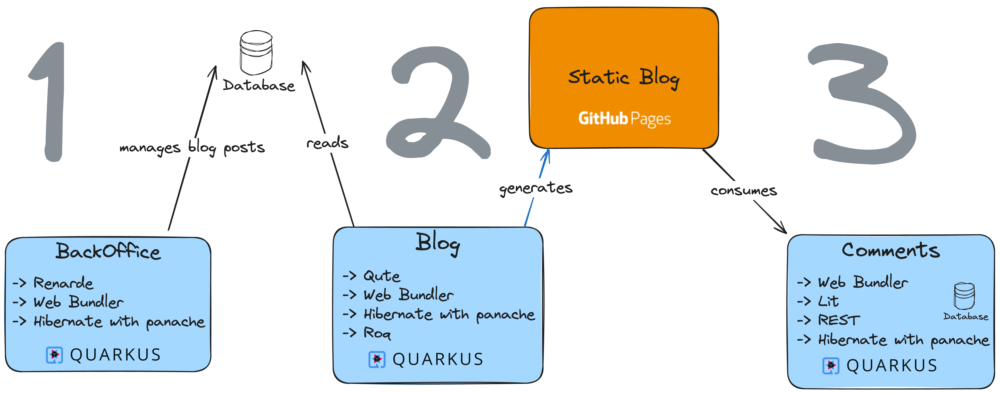
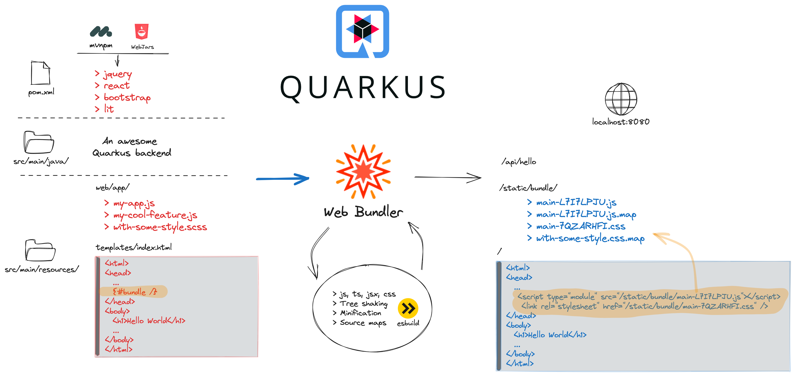

---

# Quarkus Web Lab

---

<!-- .element width="100%"  -->

---

🚀 Demo of the solution

---

### QUTE

Qute is a _templating engine_ designed to meet Quarkus needs.

---

### RENARDE

- An old-school Web Framework
- Server-side rendering for views (Qute)
- Model with Hibernate with Panache
- Controllers with RESTEasy Reactive and magic

---

### MVNPM

- Use npm like any other Maven dependency
- Auto sync and update to maven central
- importmap support

--

<!-- .element width="100%"  -->

---

### Web Bundler

`zero conf` bundling and minification for:
- your web app scripts (js, ts, jsx, tsx)
- dependencies (Lit, Htmx, Bootstrap, React, ...)
- and styles (css, scss, sass).

--

<!-- .element width="100%"  -->

